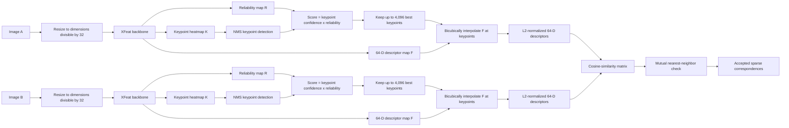

# XFeat matching flowcharts

These diagrams describe the two matching paths implemented in
`modules/xfeat.py`. The standalone `.mmd` files contain editable Mermaid
source.

## 1. Sparse keypoint matching: XFeat

The mutual check accepts a pair only when the feature in Image A selects the
feature in Image B and that Image B feature selects the same Image A feature.

## 2. Coarse semi-dense matching: XFeat*

```mermaid
flowchart LR
    A[Image A] --> MA[Create two image scales]
    B[Image B] --> MB[Create two image scales]

    MA --> NA[XFeat backbone at both scales]
    MB --> NB[XFeat backbone at both scales]

    NA --> FA[Coarse 64-D descriptor maps F]
    NA --> RA[Coarse reliability maps R]
    NB --> FB[Coarse 64-D descriptor maps F]
    NB --> RB[Coarse reliability maps R]

    FA --> GA[One descriptor per coarse grid cell]
    RA --> TA[Rank cells by reliability]
    GA --> TA
    FB --> GB[One descriptor per coarse grid cell]
    RB --> TB[Rank cells by reliability]
    GB --> TB

    TA --> KA[Keep up to 10,000 reliable features]
    TB --> KB[Keep up to 10,000 reliable features]

    KA --> C[Cosine-similarity matrix]
    KB --> C
    C --> M[Mutual nearest-neighbor coarse matches]

    M --> P[Concatenate the two matched descriptors]
    P --> R[Learned refinement module]
    R --> O[Predict sub-cell offset and confidence]
    O --> Q[Discard low-confidence refinements]
    Q --> Z[Pixel-level semi-dense correspondences]
```

"Coarse" means that descriptors lie on a feature grid with one location for
approximately each 8-by-8 input-image region. The refinement module predicts
an offset within that region to recover a more precise correspondence.

## Scale note

The CVPR paper describes XFeat* scales of 0.65 and 1.3. The current repository
implementation in `extract_dualscale` uses 0.6 and 1.3 after code refactoring.
The diagrams intentionally say "two image scales" so they describe both the
paper protocol and the current implementation without hiding this difference.
